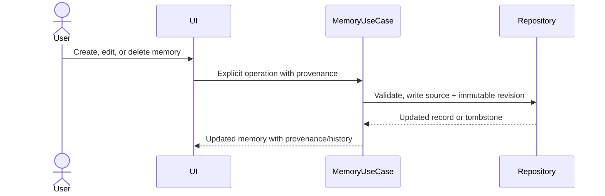

# Context for AI — Sequence Flows

## Process user message

```mermaid
sequenceDiagram
    actor User
    participant FG as Foreground owner
    participant App as ProcessUserMessage
    participant DB as Repositories
    participant Context as Deterministic context engine
    participant Packet as ContextPacketStage
    participant Model as ModelGateway
    participant Validate as ResponseValidator

    User->>FG: Submit exact text + key
    FG->>App: execute(request, owned token)
    App->>DB: Acceptance transaction: lookup key
    alt Existing key
        DB-->>App: Existing run snapshot, no mutation
        App-->>FG: ExistingRunResult
    else New key
        App->>DB: Check global non-terminal run
        alt Global run active
            DB-->>App: Active run ID/status, no mutation
            App-->>FG: BusyResult
        else Admission open
            App->>DB: Exact user message + project/version + PERSISTED run
            DB-->>App: Acceptance committed
            App->>Context: Pure interpret/resolve/constrain/retrieve/build inputs
            App->>DB: Open outer context transaction
            alt Clarification
                App->>DB: Evidence + one clarification + NEEDS_CLARIFICATION
                DB-->>App: One outer commit
                App-->>FG: ClarificationResult
            else No clarification
                App->>Packet: execute(build request), joining outer transaction
                alt Packet budget/context/CAS failure
                    App->>DB: Exact terminal failure, no partial context commit
                    DB-->>App: One terminal commit
                    App-->>FG: Typed failure result
                else Context ready
                    Packet->>DB: Packet/retrieval + CONTEXT_READY (joined)
                    App->>DB: Decisions + state compare-and-swap (joined)
                    DB-->>App: One outer context commit
                    loop Initial call plus at most two revisions
            App->>DB: Prepare PENDING request (+ correction for revision)
            App->>DB: Claim request IN_FLIGHT
            App->>Model: Buffered local text generation outside DB transaction
            alt Complete candidate
                Model-->>App: Complete candidate text
                App->>DB: Open candidate transaction
                App->>Validate: Deterministic validation from packet
                App->>DB: Request + response + report; commit
                alt Valid
                    App->>DB: Byte-exact assistant link + SUCCEEDED
                    App-->>FG: SucceededResult
                else Invalid and revisions remain
                    App->>DB: Adjacent correction + next PENDING request
                else Invalid and exhausted
                    App->>DB: Exact VALIDATION_EXHAUSTED failure
                    App-->>FG: ValidationExhaustedResult; no candidate
                end
            else Timeout, cancellation, or transport failure
                Model-->>App: Typed failure
                App->>DB: Exact request/failure/run mapping
                App-->>FG: ControlledFailureResult or CancelledResult
            end
                    end
                end
            end
        end
    end
```

## One-shot startup recovery

```mermaid
sequenceDiagram
    participant Boot as Startup coordinator
    participant FG as Foreground owner
    participant Recovery as RecoverProcessingRun
    participant DB as Repositories
    participant Model as ModelGateway

    Boot->>Boot: Validate config + migrate database
    Boot->>FG: Run one recovery before enabling submit
    FG->>Recovery: execute(empty request, fresh token)
    Recovery->>DB: Load sole global non-terminal run + lineage
    alt No active run
        Recovery-->>FG: NoRecoveryRequiredResult
    else Fingerprint mismatch or impossible state
        Recovery->>DB: Exact RECOVERY failure + FAILED
        Recovery-->>FG: RecoveryCompletedResult
    else IN_FLIGHT request
        Recovery->>DB: Request/run FAILED + PROCESS_RESTARTED
        Note over Recovery,Model: Never repeat uncertain call
        Recovery-->>FG: RecoveryCompletedResult
    else Resumable deterministic or PENDING state
        Recovery->>Recovery: Continue one bounded foreground matrix action
        opt PENDING request is claimable
            Recovery->>DB: Claim IN_FLIGHT
            Recovery->>Model: Fresh token; outside transaction
        end
        Recovery-->>FG: Terminal result or PersistenceFailureResult
    end
    FG-->>Boot: Immutable recovery DTO
    Boot->>Boot: Enable submit only after return
```

## Explicit memory edit


