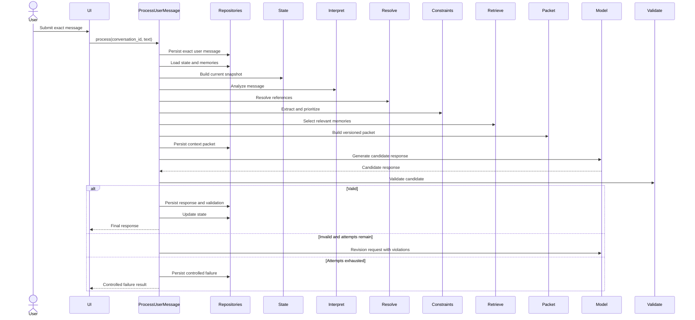
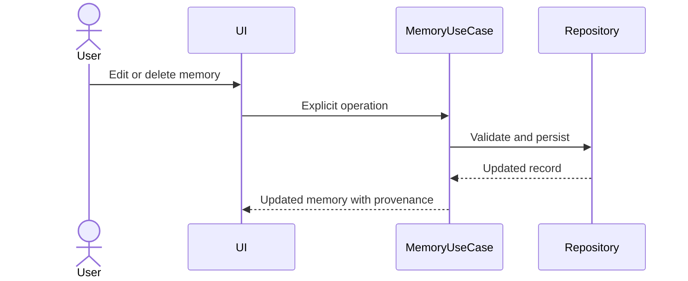

# Context for AI — Sequence Flows

## Process user message

```mermaid
sequenceDiagram
    actor User
    participant UI
    participant App as ProcessUserMessage
    participant DB as Repositories
    participant State
    participant Interpret
    participant Resolve
    participant Constraints
    participant Retrieve
    participant Packet
    participant Model
    participant Validate

    User->>UI: Submit exact message
    UI->>App: process(conversation_id, text)
    App->>DB: Persist exact user message
    App->>DB: Load state and memories
    App->>State: Build current snapshot
    App->>Interpret: Analyze message
    App->>Resolve: Resolve references
    App->>Constraints: Extract and prioritize
    App->>Retrieve: Select relevant memories
    App->>Packet: Build versioned packet
    App->>DB: Persist context packet
    App->>Model: Generate candidate response
    Model-->>App: Candidate response
    App->>Validate: Validate candidate
    alt Valid
        App->>DB: Persist response and validation
        App->>DB: Update state
        App-->>UI: Final response
    else Invalid and attempts remain
        App->>Model: Revision request with violations
    else Attempts exhausted
        App->>DB: Persist controlled failure
        App-->>UI: Controlled failure result
    end
```

## Memory edit

```mermaid
sequenceDiagram
    actor User
    participant UI
    participant MemoryUseCase
    participant Repository

    User->>UI: Edit or delete memory
    UI->>MemoryUseCase: Explicit operation
    MemoryUseCase->>Repository: Validate and persist
    Repository-->>MemoryUseCase: Updated record
    MemoryUseCase-->>UI: Updated memory with provenance
```
