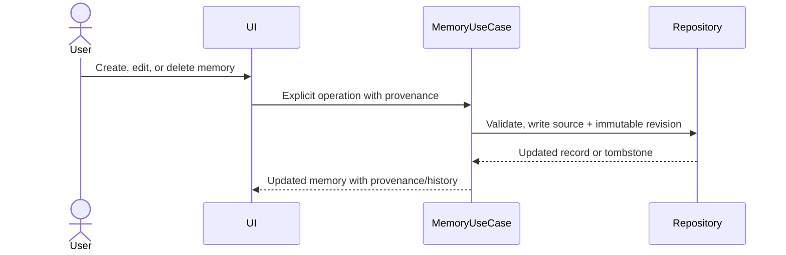

# Context for AI — Sequence Flows

## Process user message

```mermaid
sequenceDiagram
    actor User
    participant UI
    participant App as ProcessUserMessage
    participant DB as Repositories
    participant Context as Deterministic context engine
    participant Model as Local Ollama gateway
    participant Validate as ResponseValidator

    User->>UI: Submit text + idempotency key
    UI->>App: process(conversation_id, text, key, project?)
    App->>DB: Acceptance transaction: persist exact user message + PERSISTED run
    App->>DB: Load versioned state, entities, eligible memories
    App->>Context: Interpret, resolve, constrain, retrieve, build packet
    alt Clarification or context-budget failure
        App->>DB: Persist terminal status and evidence
        App-->>UI: Clarification or controlled failure
    else Context ready
        App->>DB: Context transaction: decisions + immutable packet
        loop Initial call plus at most two revisions
            App->>DB: Request-start transaction
            App->>Model: Buffered local text generation outside DB transaction
            alt Complete candidate
                Model-->>App: Complete candidate text
                App->>Validate: Deterministic validation
                App->>DB: Persist candidate + validation report
                alt Valid
                    App->>DB: Terminal transaction: assistant message + state + SUCCEEDED
                    App-->>UI: Validated final text
                else Invalid and revisions remain
                    App->>DB: Persist correction envelope/request
                else Invalid and exhausted
                    App->>DB: Persist CONTROLLED_FAILURE
                    App-->>UI: Controlled failure; do not show candidate
                end
            else Timeout, cancellation, or transport failure
                Model-->>App: Typed failure
                App->>DB: Persist terminal failure
                App-->>UI: Controlled failure or cancelled status
            end
        end
    end
```

## Explicit memory edit


